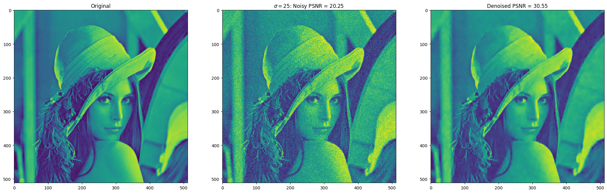
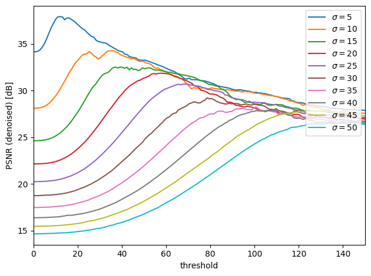

# DCT-2D-filter

[](https://opensource.org/licenses/MIT)


Overlapping 2D Discrete Cosine Transform matrix (image) filter based on non-linear thresholding, written in C. The original reference of 2D-DCT transform functions (dct.c/h) unknown (from SGN-3057 course, TUT).

</br>

</br>

| sigma | PSNR +- std (noisy) [dB] | PSNR +- std (denoised) [dB] | optimal threshold |
|---|---|---|---|
|5 | 34.15 +- 0.01 | 38.15 +- 0.29 | 12.1 |
|10 | 28.14 +- 0.02 | 33.34 +- 0.88 | 36.2 |
|15 | 24.61 +- 0.01 | 32.75 +- 0.48 | 39.3 |
|20 | 22.14 +- 0.01 | 31.29 +- 0.63 | 57.4 |
|25 | 20.25 +- 0.01 | 30.55 +- 0.27 | 68.5 |
|30 | 18.73 +- 0.01 | 29.44 +- 0.30 | 78.5 |
|35 | 17.45 +- 0.01 | 28.72 +- 0.36 | 100.7 |
|40 | 16.38 +- 0.01 | 27.67 +- 0.42 | 105.7 |
|45 | 15.45 +- 0.01 | 26.88 +- 0.43 | 126.8 |
|50 | 14.65 +- 0.01 | 26.12 +- 0.53 | 145.0 |

</br>

</br>


## Compile filter

Tested with g++ 9.3
```
g++ -O3 dctfilter.c dct.c -o dctfilter
```

## Run filter

Input and output type is a 64-bit floating point single channel matrix
```
./dctfilter [-i inputfile] [-o outputfile] [-m nrows] [-n ncols] [-s step] [-t threshold] [-q quiet]
```

## Run full simulations

Gaussian simulations with varying noise levels
```
conda create -y --name dctfilter python==3.9.0
conda activate dctfilter
pip install -r requirements.txt

python simulate.py
```

</br>

Mikael Mieskolainen, {2011, 2021}
